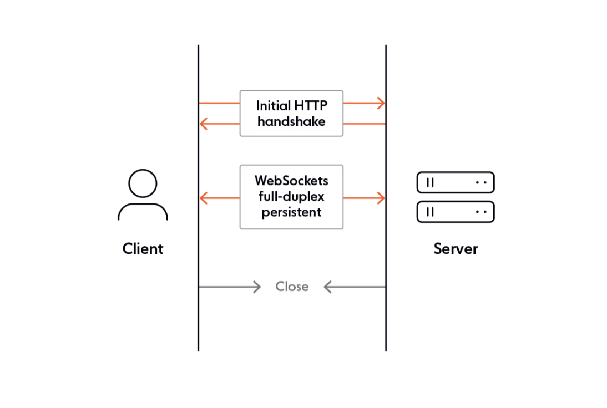

# About WebSockets

- The WS connection is a way to establish full duplex communication channel between 2 services. A full duplex communication means allows data to be transmitted and received simultaneously in both direction. For eg: Telephone Calls.

- The WS connection has its own WS protocol.

# Opening a Websocket connection



- The WS connection starts with a WS handshake initiated by the client. The request sent by the client to initiate the handshake is

```
> GET / HTTP/1.1
> Host: localhost:3001
> User-Agent: curl/8.7.1
> Accept: */*
> Upgrade: websocket
> Connection: Upgrade
> Sec-WebSocket-Key: dGhlIHNhbXBsZSBub25jZQ==
> Sec-WebSocket-Version: 13
```

- Here, the `Host` is the address of the websocket server and `Sec-WebSocket-Key` is base-64 encoded, 16-byte random values (All this as mentioned in the specs for WS Protocol).

- The successful response by WS Server in a WS handshake is

```
< HTTP/1.1 101 Switching Protocols
< Upgrade: websocket
< Connection: Upgrade
< Sec-WebSocket-Accept: s3pPLMBiTxaQ9kYGzzhZRbK+xOo=
```

- In the above the `Sec-WebSocket-Accept` is the SHA-1 hash of `Sec-WebSocket-Key` along with something else.

( The command to initiate a websocket handshake via CLI is `curl -H "Upgrade: websocket" -H "Connection: Upgrade" -H "Sec-WebSocket-Key: dGhlIHNhbXBsZSBub25jZQ==" -H "Sec-WebSocket-Version: 13" -sSvN http://localhost:3001 --http1.1` )

- After the server returns the `101` response, the app level protocol switches from HTTP to WS.

- Note that both HTTP and WS are app level protocol and they require TCP/IP as their transport.

- WS protocol is not based on HTTP and has no relation to that after the initial handshake. While HTTP is a text based protocol, WS is a binary protocol where multiple streams of data can be send in both directions at the same time (full duplex mode)

- The websocket protocol is designed to have following characteristics:

1. No new port is required on the server side.
2. Since no new port is required, we dont need to change firewall or any other setting.
3. The same server process could handle both HTTP and WS communication.
4. HTTP Cookies / Authentication can be used during WS handshake.

- Each connection creates its own socket and then runs on that socket. What happens on one socket is independent of what happens on another socket that is currently connected.

# Data Transmission over Web Socket

- Web socket protocol follows an asynchronous, event-driven programming model. As long as web socket connection is open, the client and server simply listen for events in order to handle incoming data and changes in connection status (with no need for polling)

- With the websocket connection established, there is no need for sending HTTP headers, authentication, etc.

- The `message` event is fired when data is received through a web socket.

- To send message we use `send()` method on the socket instance.

# Closing Web Socket Connection

- Web socket connection closes automatically when the client is closed - ie the browser is closed.

- Web socket connection can be closed by firing `close` method.

# References

1. https://www.chucksacademy.com/en/topic/express-basic/websocket
2. https://ably.com/topic/websockets
3. https://stackoverflow.com/questions/28516962/how-websocket-server-handles-multiple-incoming-connection-requests
4. ChatGPT
